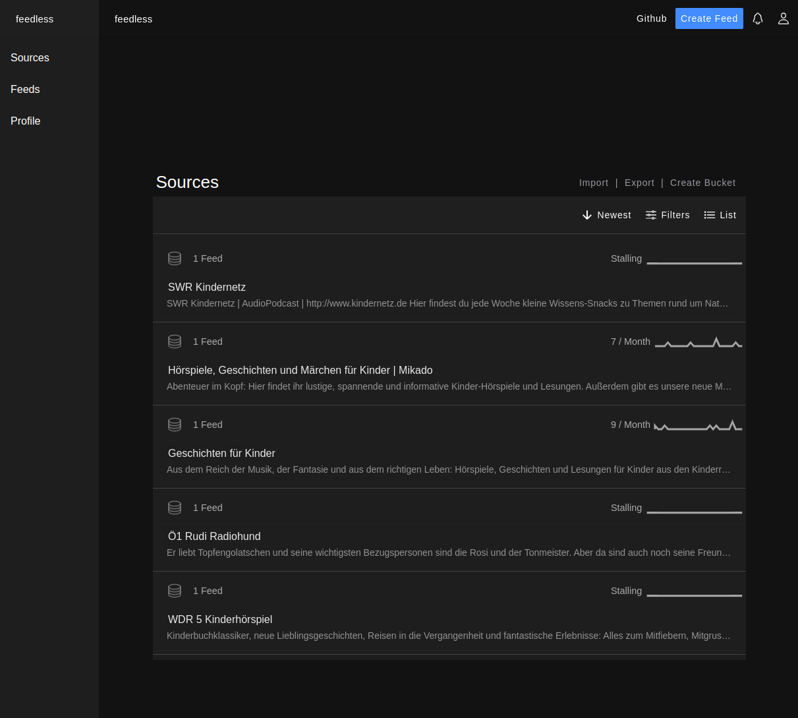

# feedless

`feedless` is a web app to create RSS+ feeds of most HTMLs and to manage any ATOM/RSS or JSON feed. These feed can be manipulated and remixed. 
It uses spring boot and angular. Its under development You can see that current state of development at [feedless.org](https://feedless.org)

## Features
- Content enrichment with Full(-text)
- Media detection using [yt-dlp](https://github.com/yt-dlp)
- [Web-to-Feed](docs/web-to-Feed.md)
- Aggregation of multiple feeds into Buckets
- [Filtering](docs/filters.md)
- [JavaScript Support](./packages/agent/README.md) of JavaScript-based websites
- Inline Images in content ()
- [Plugins](docs/plugins.md)

# Client Modules
- [app](./packages/app-web/README.md) angular UI to manage feeds
- [cli](./packages/app-cli/README.md) CLI to query articles

# Server Modules
- [core](./packages/server-core/README.md) Stateless backend
- [agent](./packages/agent/README.md) Puppeteer wrapper

# Getting Started
See [hosting](./docs/hosting.md)

## Changelog
See [changelog](changelog.md)

## Contact
feedlessapp<at>protonmail<dot>com

## Related Projects
- [feedirss](https://www.feedirss.com/)
- [nitter](https://github.com/zedeus/nitter)
- [invidious](https://github.com/iv-org/invidious)
- [siftrss](https://siftrss.com/)
- [xtractor](https://github.com/mohaps/xtractor)

## License
[EUPL-1.2](https://opensource.org/licenses/EUPL-1.2)
